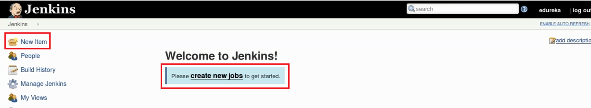
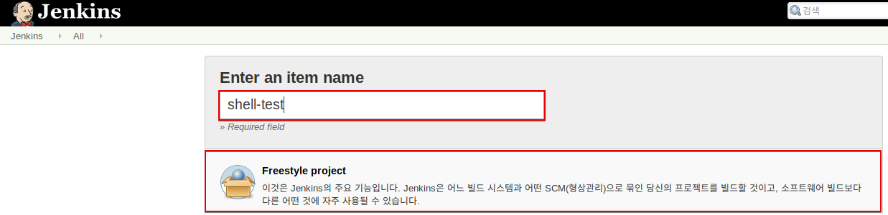
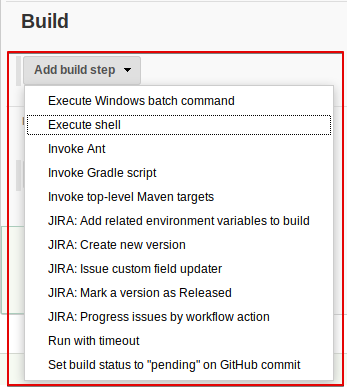
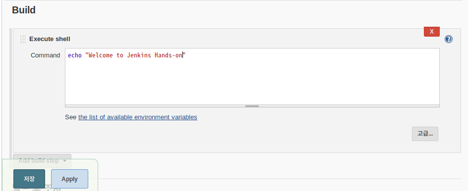
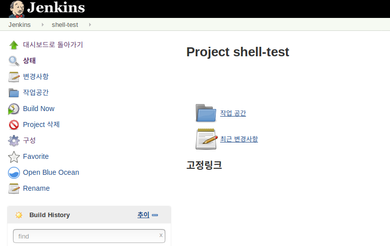
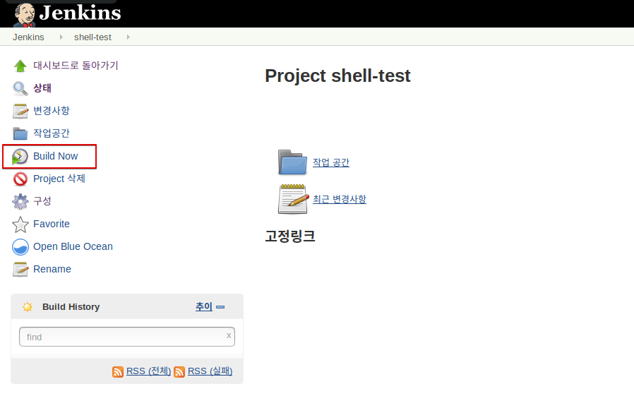
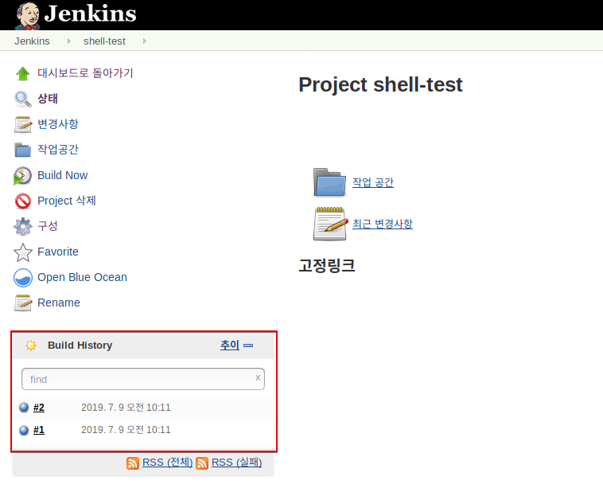
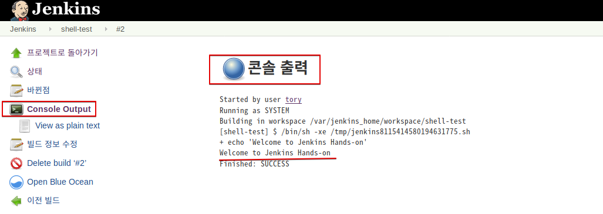
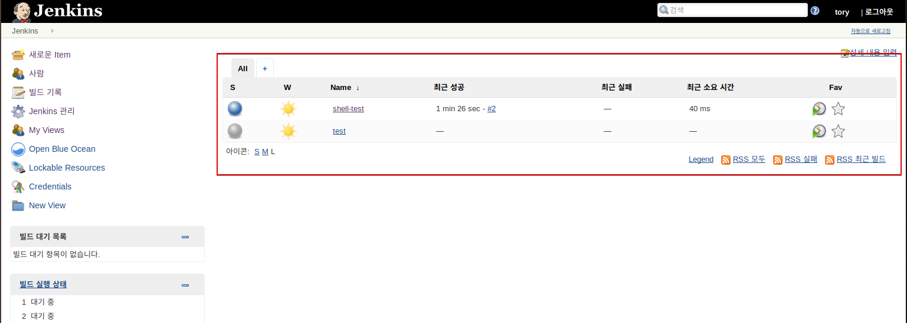

# 1.Shell을 이용한 첫번째 프로젝트 

이 실습에서는 shell을 이용한 간단한 프로젝트를 생성해 보고, Jenkins의 기본 동작 방식과 기능을 확인해 본다.

## 사전 준비 사항 
 - Jenkins 실행
 ```bash
 docker run \
  --rm \
  -u root \
  -p 8080:8080 \
  -v jenkins-data:/var/jenkins_home \
  -v /var/run/docker.sock:/var/run/docker.sock \
  -v "$HOME":/home \
  jenkinsci/blueocean
 ```
 - Jenkins UI 접속   
   http://localhost:8080


> 참고 : `-v jenkins-data:/var/jenkins_home` 옵션은 컨테이너의 `/var/jenkins_home` 디렉토리를 docker 의 볼륨으로 설정한다. (호스트의 `/var/lib/docker/volumes/jenkins-data`)  
   `-v "$HOME":/home` 는 호스트의 $HOME 디렉토리를 컨테이너의 `/home`와 매핑한다. 


### Step 1 :  Jenkins 화면에서 **New Item** 클릭



### Step 2 : Item 이름과 **Freestyle project** 선택



### Step 3 : 다음에 Job 설정 화면에서, Build 에서 **Add build step** drop down을 클릭하고 "execute shell" 클릭


### Step 4 : Execute shell -> command 에 Shell 명령을 입력하고 저장을 클릭한다. 

Ex) echo "Welcome to Jenkins Hands-on"



### 저장 버튼을 클릭하면 프로젝트 화면으로 전환된다. 


### Step 5 : **Build Now**를 클릭해서 Build 를 시작한다. 



### Step 6 : **Build History** 영역에서 Build를 진행한 이력을 확인할 수 있다. 



### Step 7 : **Console Output** 메뉴를 크릭해서 실행했던 Job의 실행 결과를 확인한다. 




### Step 8 : 좌측 상태의 아이콘을 눌러 Jenkins Home으로 돌아오면 모든 프로젝트 현황과 정보를 볼 수 있다. 




***W*** 컬럼은 Weather의 준말로 빌드 결과를 날씨로 표현하는 아이콘으로 표현해 준다.  


> 추가했으면 좋겠는 내용 before & After 내용
