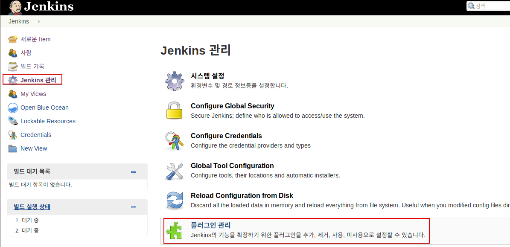
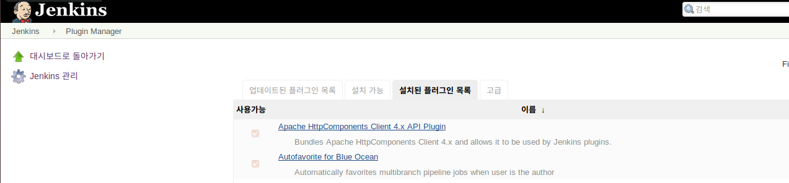
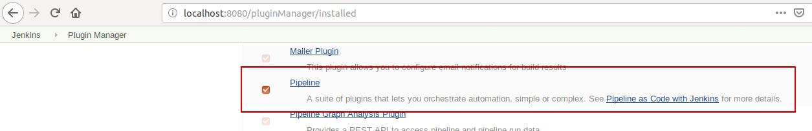
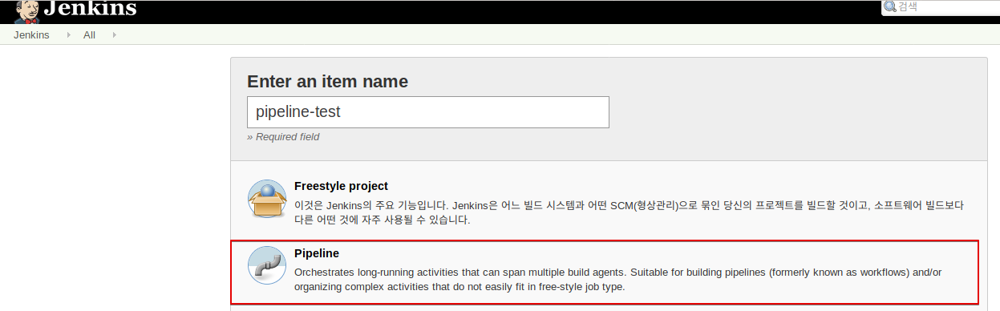
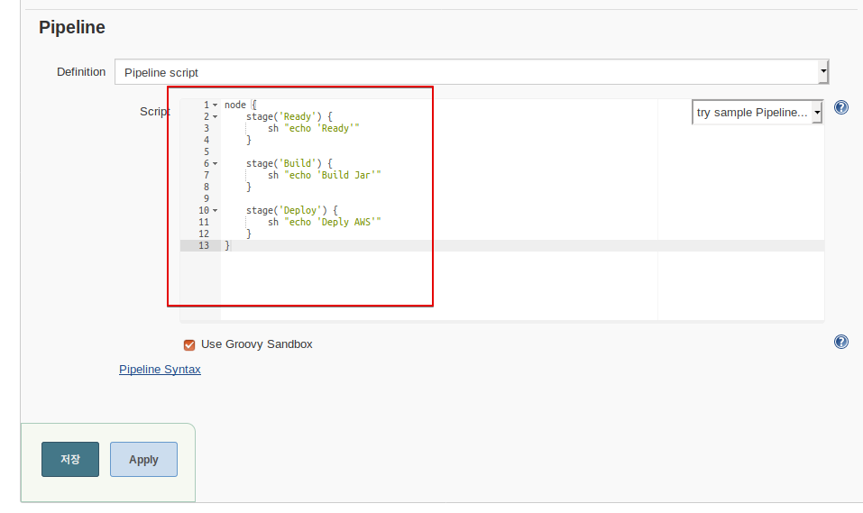
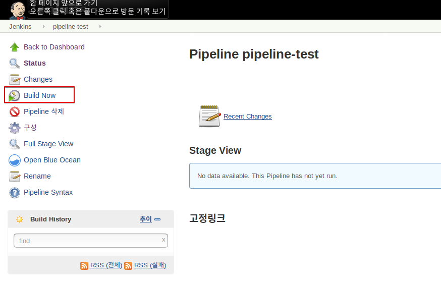
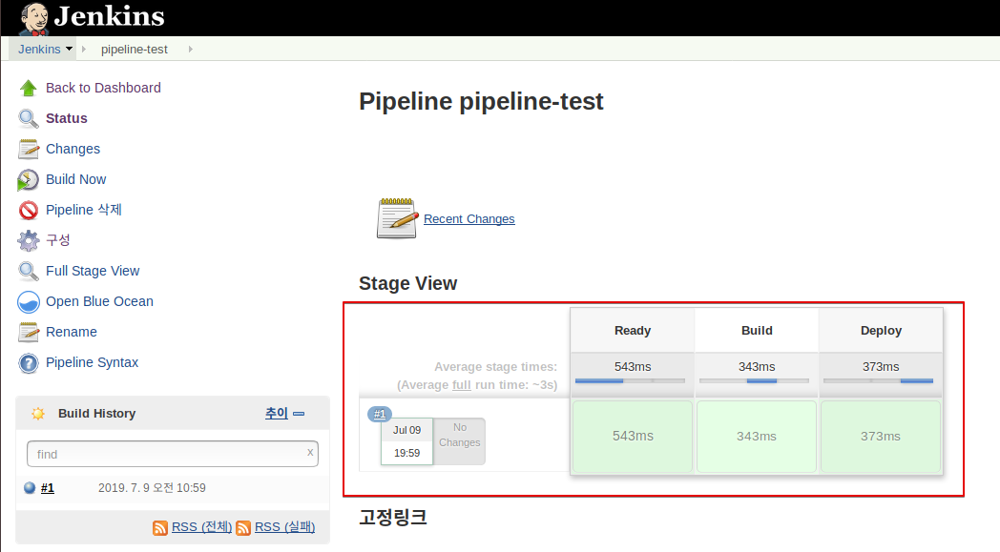
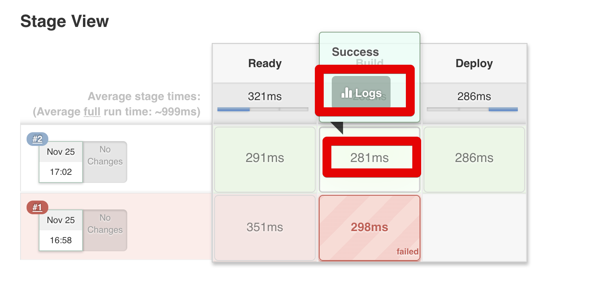
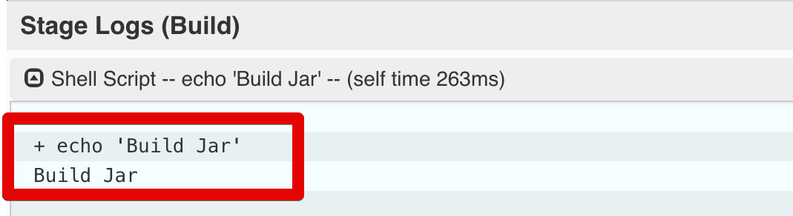
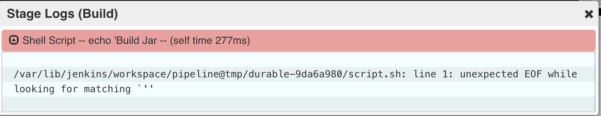

# 2. Pipeline 생성하기

이 실습에서는 Pipeline
기능을 확인해 본다.

> 젠킨스의 파이프라인이란 연속적인 이벤트 혹은 Job의 그룹을 얘기한다.  
즉, 각자 만든 젠킨스 Job들을 순차적 혹은 병렬적으로 실행시키거나 특별하게 작성한 스크립트로 이벤트들을 연속적으로 실행시키는 등의 일을 지원하는 기능이다.

> 간단히 말해, Jenkins Pipeline은 Jenkins를 사용하여 연속적인 전달 파이프 라인 의 통합 및 구현을 지원하는 플러그인의 조합이다. 파이프 라인은 파이프 라인 DSL (Domain-Specific Language)을 통해 간단한 파이브 라인 부터 복잡한 전달 파이프 라인을 "코드"로 생성 할 수있는 확장 가능한 자동화 서버를 갖추고 있다

# 1.Shell을 이용한 첫번째 프로젝트 

이 실습에서는 shell을 이용한 간단한 프로젝트를 생성해 보고, Jenkins의 기본 동작 방식과 기능을 확인해 본다.

## 사전 준비 사항 
 - Jenkins 실행
 ```bash
 docker run \
  --rm \
  -u root \
  -p 8080:8080 \
  -v jenkins-data:/var/jenkins_home \
  -v /var/run/docker.sock:/var/run/docker.sock \
  -v "$HOME":/home \
  jenkinsci/blueocean
 ```
 - Jenkins UI 접속   
   http://localhost:8080


> 참고 : `-v jenkins-data:/var/jenkins_home` 옵션은 컨테이너의 `/var/jenkins_home` 디렉토리를 docker 의 볼륨으로 설정한다. (호스트의 `/var/lib/docker/volumes/jenkins-data`)  
   `-v "$HOME":/home` 는 호스트의 $HOME 디렉토리를 컨테이너의 `/home`와 매핑한다. 


### Step 1 : Pipeline Plugin 확인
파이프라인을 만들기 전에 Pipeline Plugin이 설치되어있는지 확인해본다.   
`Jenkins 관리` -> `플러그인 관리`를 클릭


아래와 같이 `설치된 플러그인` 탭 목록에 Pipeline이 있으면 된다.



### Step 2 : 새로운 Item 생성
Jenkins Home에서 `새로운 Item` 메뉴를 클릭하고 Item Name에 새로운 이름(ex:Pipeline-test)를 입력하고 **Pipeline**을 선택하고 저장을 클릭한다. 
 

Job 설정 화면의 하단으로 내려가면 Pipeline 탭이 있다. 
여기에 파이프라인 코드를 작성해야한다.  
아래 샘플 코드를 그대로 입력하고 저장을 클릭한다. 

 

```bash
node {
    stage('Ready') {
        sh "echo 'Ready'"
    }

    stage('Build') {
        sh "echo 'Build Jar'"
    }

    stage('Deploy') {
        sh "echo 'Deply AWS'"
    }
}
```
이 코드는 파이프라인을 각 스테이지 별로(`Ready`, `Build`, `Deploy`) 나눠서 스테이지 뱔로 명령을 실행하는 예시 이다. 

### Step 3 : Build 
Pipeline 생성이 끝나시면 아래와 같이 `Build Now`를 클릭해서 Pipeline을 실행해본다. 

 

실행하면 작성한 코드의 stage에 작성된 이름이 Stage View에 표기된다. 
그리고 각 스테이지에서 소요된 시간이 얼마나 걸렸는지도 함께 볼 수 있다. 

 

 각 스테이지별로 상세 로그가 보고 싶으시면 해당 스테이지를 클릭 -> `Logs` 버튼 클릭으로 볼 수 있다.

  

  성공할 경우 실행 결과가 아래와 같이 나타나고,  
  
  실패했다면 아래와 같이 상세한 로그를 볼 수 있다.
  

  간단하게 파이프라인을 만들어 보았다. 
방금 진행한 샘플의 경우 기존에 생성된 젠킨스 Job들을 이용하지 않고, 파이프라인 자체적인 이벤트들 (stage들의 묶음) 이용해보았다.

젠킨스 파이프라인은 2가지 문법을 지원한다. 
Scripted와 Declarative입니다.

Scripted 문법의 경우 Groovy로 빌드되기 때문에 일반적으로 파이프라인을 생성하는데 Declarative 보다 훨씬 유연한 방법이다. 
반면, Declarative의 경우 Scripted보다 훨씬 더 간단하게 작성할 수 있는 방법이다. 
대신 고정된 방식으로만 사용해야한다.

### Reference
 - https://jojoldu.tistory.com/355