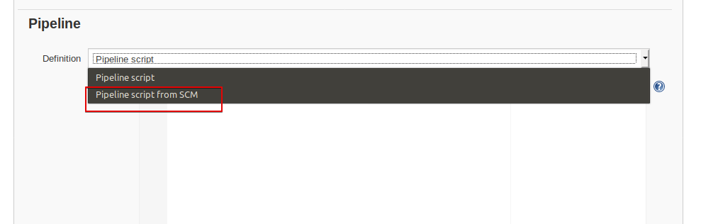
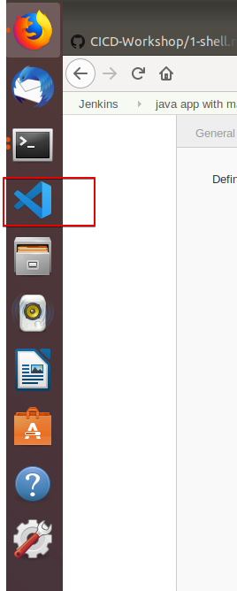

# 3. Java 애플리케이션 

이 실습에서는 Java 애플이케이션을 Maven을 이용해 빌드하는 실습을 통해서 Pipeline을 생성하는 방법을 확인해 본다. 

# 1.Shell을 이용한 첫번째 프로젝트 

이 실습에서는 shell을 이용한 간단한 프로젝트를 생성해 보고, Jenkins의 기본 동작 방식과 기능을 확인해 본다.

## 사전 준비 사항 
 - Jenkins 실행
 ```bash
 docker run \
  --rm \
  -u root \
  -p 8080:8080 \
  -v jenkins-data:/var/jenkins_home \
  -v /var/run/docker.sock:/var/run/docker.sock \
  -v "$HOME":/home \
  jenkinsci/blueocean
 ```
 - Jenkins UI 접속   
   http://localhost:8080


> 참고 : `-v jenkins-data:/var/jenkins_home` 옵션은 컨테이너의 `/var/jenkins_home` 디렉토리를 docker 의 볼륨으로 설정한다. (호스트의 `/var/lib/docker/volumes/jenkins-data`)  
   `-v "$HOME":/home` 는 호스트의 $HOME 디렉토리를 컨테이너의 `/home`와 매핑한다. 


### Step 1 :  Fork and clone

1. Fork sample repository
아래 github repository를 각자의 github repository로 Fork한다. 


2. Fork한 소스코드를 Local에 Clone한다. 
각자의 github 계정으로 Fork된 코드를 Local 로 Clone하기 위해서 아래 처럼 clone url을 복사해서 git clone 명령을 실행한다. 


```bash
#git clone
$ git clone https://github.com/DannyKang/simple-java-maven-app.git

# 생성 확인
$ ls
```


### Step 2 :  Pipeline Project 생성
[앞으로 예제](2-pipeline.md)에서 처럼 Pipeline Project를 생성한다. 

1. New Item 을 클릭하고 Item Name을 입력하고 Pipeline을 클릭한다. 


2. Pipeline 탭을 클릭하고 **Definition**에 **Pipeline script from SCM**를 클릭


3. **SCM**에 **git**선택


4. **Repository URL**에 `/home/simple-java-maven-app`입력
clone으로 받은 디렉토리의 Jenkins Container로 매핑된 디렉토리를기재한다. 


5. 저장
저장 버튼을 눌러 파이프라인을 저장한다. 

### Step 3 :  Pipeline as Jenkinsfile 생성

이제 Jenkinsfile을 이용해 Pipeline을 관리하고 Git Repository에 저장하게 된다. 이것을 "Pipeline-as-Code"라는 용어를 쓴다. 

이제 Maven Docker Image을 다운 받아서 

1. Visual Code를 실행해서 simple-java-maven-app Git repository에 `Jenkinsfile`를 생성한다. 

 - 왼쪽 즐겨찾기 바에서 VS 클릭


 - File-> Open Folder


 - /home/tory/simple-java-mave-app 클릭


 - Jenkinsfile 생성
 

 

```Jenkinsfile
pipeline {
    agent {
        docker {
            image 'maven:3-alpine' 
            args '-v /root/.m2:/root/.m2' 
        }
    }
    stages {
        stage('Build') { 
            steps {
                sh 'mvn -B -DskipTests clean package' 
            }
        }
    }
}

### Step 4 :  Local Git에 Commit


```shell
# Git Log in

$ git config --global user.name "John Doe"
$ git config --global user.email johndoe@example.com


# Git add
git add .

# Git commmit

git commit -m "Add initial Jenkinsfile"
```


### Step 5 :  Blue Occean 에서 실행 확인

1. Open Blue Occean 클릭


2. Run을 클릭해서 실행 시킨다.


3. Build Stage별로 진행 사항을 확인


4. 완료를 확인하고 우측 상단의 X 를 클릭한다. 


### Step 6 :  Test stage 추가 

1. Visual Code에서 Jenkinsfile에 아래 내용을 추가한다. 


```Jenkinsfile
 stage('Test') {
            steps {
                sh 'mvn test'
            }
            post {
                always {
                    junit 'target/surefire-reports/*.xml'
                }
            }
        }
```
 - 전체 소스는 아래와 같다
```Jenkinsfile
pipeline {
    agent {
        docker {
            image 'maven:3-alpine'
            args '-v /root/.m2:/root/.m2'
        }
    }
    stages {
        stage('Build') {
            steps {
                sh 'mvn -B -DskipTests clean package'
            }
        }
        stage('Test') { 
            steps {
                sh 'mvn test' 
            }
            post {
                always {
                    junit 'target/surefire-reports/*.xml' 
                }
            }
        }
    }
```

5. git commit

```shell


# Git add
git stage .

# Git commmit

git commit -m "Add 'Test' stage"
```

### Step 7 :  Blue Occean 에서 실행 확인

2. Run을 클릭해서 실행 시킨다.


3. Test Stage 추가 확인


### Step 8 : Delivery Stage 추가 

1. Deliver State를 추가해서 프로젝트에 포함되어 있는 `./jenkins/scripts/deliver.sh`를 실행한다. 
```Jenkinsfile
        stage('Deliver') {
            steps {
                sh './jenkins/scripts/deliver.sh'
            }
        }
```
 - 완성된 파일은 다음과 같다.
```Jenkinsfile
pipeline {
    agent {
        docker {
            image 'maven:3-alpine'
            args '-v /root/.m2:/root/.m2'
        }
    }
    options {
        skipStagesAfterUnstable()
    }
    stages {
        stage('Build') {
            steps {
                sh 'mvn -B -DskipTests clean package'
            }
        }
        stage('Test') {
            steps {
                sh 'mvn test'
            }
            post {
                always {
                    junit 'target/surefire-reports/*.xml'
                }
            }
        }
        stage('Deliver') { 
            steps {
                sh './jenkins/scripts/deliver.sh' 
            }
        }
    }
}

```

2. git commit

```shell


# Git add
git stage .

# Git commmit

git commit -m "Add 'Deliver' stage"
```

3. 결과 확인


### Reference 
 - https://jenkins.io/doc/tutorials/build-a-java-app-with-maven/