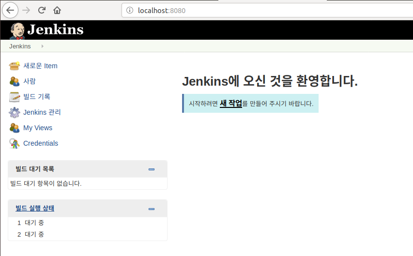

#Docker Container로 Jenkins 설치하기


## 1. Jenkins Image Pull

```bash
$ docker pull jenkins
```

가장 최근 버전의 jenkins 이미지가 pull 된다.

특정한 버전의 jenkins를 받고 싶으면, docker hub의 jenkins repository에 들어가서 원하는 tag를 찾아서 pull 받으면 되겠다.


## 2. Jenkins 이미지 실행

```bash
$ docker run -d -p 8080:8080 -v /jenkins:/var/jenkins_home --name jenkins -u root jenkins
```

```bash
$ docker run \
  --rm \
  -u root \
  -p 8080:8080 \
  -v jenkins-data:/var/jenkins_home \
  -v /var/run/docker.sock:/var/run/docker.sock \
  -v "$HOME":/home \
  jenkinsci/blueocean
```

docker run \
  --rm \
  -u root \
  -p 8080:8080 \
  -v /Users/kih/Dev/jenkins:/var/jenkins_home \
  -v /var/run/docker.sock:/var/run/docker.sock \
  -v "$HOME":/home \
  jenkinsci/blueocean


docker run 명령어로 jenkins 이미지를 컨테이너로 구동한다.

각각의 옵션들에 대해서 간단하게 설명하면 아래와 같다.

>-d : 데몬 상태로 실행한다는 뜻이다. 이 옵션을 주지 않으면, 실행되는 로그를 바로 보여준다.
>
>-p : 컨테이너 내부의 포트를 외부로 내보낼 포트로 연결시켜준다.
>
>-v : 호스트에 볼륨을 지정해 주는 것이다. 굳이 하지 않아도 되지만, 만약 해당 컨테이너가 삭제되면 내부에 작성했던 스크립트 등의 데이터가 다 없어지기 때문에 볼륨을 지정해 외부에 백업하는 용도로 볼륨을 잡았다.
>
>--name : 해당 컨테이너의 이름을 지정해준다.
>
>-u : root 사용자로 실행되게 하기 위해 지정해 줬다.

## 3. 브라우저 접속
브라우저로 접속 http://localhost:8080


## 4. jenkins 로그로 확인하기

```bash
$ docker logs jenkins 
```


jenkins가 구동되며 출력된 로그들을 볼 수 있고, 그 중 위와 같은 비밀번호를 확인할 수 있다.

이 비밀번호를 조금 전 브라우저에서 접속한 웹 화면에 입력하자.

## 5. 플러그인 설치

처음 설치할 플러그인들을 선택하는 화면이 나온다.

일단 기본 권장 플러그인들을 선택하고 설치를 진행했다. 추후 필요한 플러그인들은 젠킨스 내부에서 쉽게 설치할 수 있다.


## 6. First Admin User 생성

해당 젠킨스 서버의 Admin User를 생성해 준다.


## 7. 설치 완료

Jenkins를 사용할 준비가 완료되었다. 새로운 Job을 만들어서 사용을 시작하면 된다.


### Reference
 - https://www.leafcats.com/215