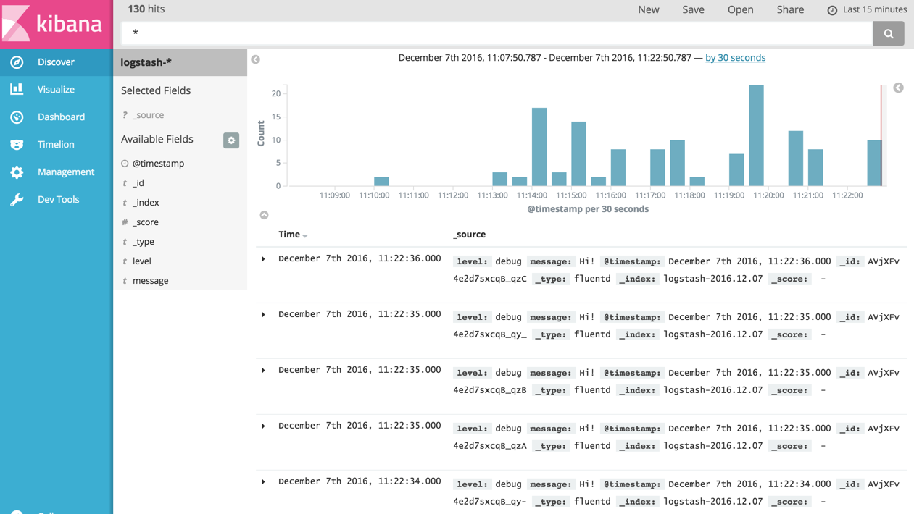
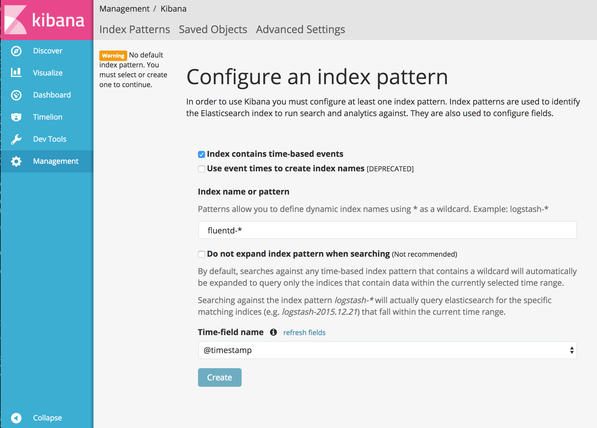
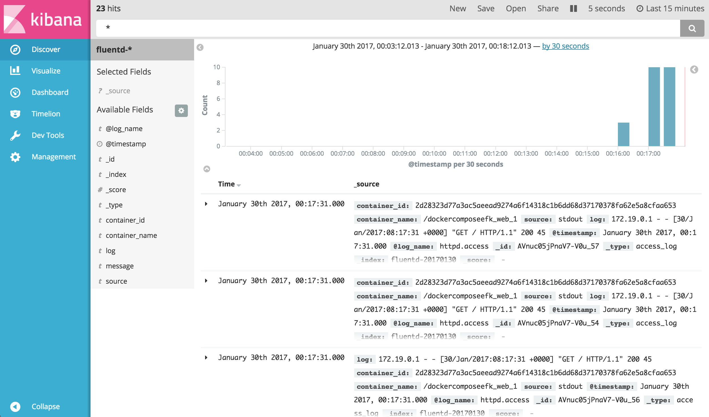

# Container Logging


```bash
$ docker run --name logtest debian sh -c 'echo "stdout"; echo "stderr" >&2’
stderr
stdout

$ docker logs logtest   
stderr  
stdout

$ docker logs -t logtest 		// -t 파라미터를 이용하면 타임스탬프를 보여준다.   
2019-06-27T10:30:54.002057314Z stderr   
2019-06-27T10:30:54.005335068Z stdout
$ docker run -d --name streamtest debian \
      sh -c 'while true; do echo "tick"; sleep 1;done;’.  
13aa6ee6406a998350781f994b23ce69ed6c38daa69c2c83263c863337a38ef9
$ docker logs -f streamtest.    // –f를 이용하면 실행중인 컨테이너의 로그를 스트림할 수 있다
tick
```

### log 내용 확인
```bash  

/var/lib/docker/containers/<container id>/<container id>-json.log

```


# Docker Logging EFK Compose
이 실습에서는 Docker logs를 EFK(Elasticsearch + Fluentd + Kibana)로 모으는 과정을, 여러 컨테이너의 설정을  Docker compose 를 사용해서 실습한다. 



아래 4개의 컨테이너를 사용한다. 

 - Apache HTTP Server
 - Fluentd
 - Elasticsearch
 - Kibana

`httpd`의 모든 logs를 EFK로 적재하게 된다. 

## Step 0 : docker-compose.yml 파일 준비
Docker compose를 여러 컨테이너 같은 머신에서 실행할 수 있도록 하는 툴이다.

아래의 yaml 파일을 이용해 4개의 컨테이너를 기동할 수 있다. 
```yaml
version: '2'
services:
  web:
    image: httpd
    ports:
      - "80:80"
    links:
      - fluentd
    logging:
      driver: "fluentd"
      options:
        fluentd-address: localhost:24224
        tag: httpd.access

  fluentd:
    build: ./fluentd
    volumes:
      - ./fluentd/conf:/fluentd/etc
    links:
      - "elasticsearch"
    ports:
      - "24224:24224"
      - "24224:24224/udp"

  elasticsearch:
    image: elasticsearch
    expose:
      - 9200
    ports:
      - "9200:9200"

  kibana:
    image: kibana
    links:
      - "elasticsearch"
    ports:
      - "5601:5601"

```

`web`:`logging`:`driver`에 정의되어 있는 주소로 자동으로 log가 forward 될 것이다. 

##Step 1: 설정을 추가한 Fluentd image 준비

아래와 같은 `fluentd/Dockerfile`을 준비해서 Fluentd 공식 image에 Elasticsearch plugin을 install 한다. 

```Dockerfile
# fluentd/Dockerfile
FROM fluent/fluentd:v0.12-debian
RUN ["gem", "install", "fluent-plugin-elasticsearch", "--no-rdoc", "--no-ri", "--version", "1.9.2"]
```

그리고 Fluentd 설정 파일을 fluentd/conf/fluent.conf 설정한다. 
docker가 forward하는 log를 Elasticsearch로 전달한다. 
```conf
# fluentd/conf/fluent.conf
<source>
  @type forward
  port 24224
  bind 0.0.0.0
</source>
<match *.**>
  @type copy
  <store>
    @type elasticsearch
    host elasticsearch
    port 9200
    logstash_format true
    logstash_prefix fluentd
    logstash_dateformat %Y%m%d
    include_tag_key true
    type_name access_log
    tag_key @log_name
    flush_interval 1s
  </store>
  <store>
    @type stdout
  </store>
</match>
```

## Step 2: Container 실행

컨테이너 실행
```bash
$ docker-compose up
```

`docker ps`로 컨테이너 실행 확인
```bash
$ docker ps
CONTAINER ID        IMAGE                      COMMAND                  CREATED             STATUS              PORTS                                                          NAMES
2d28323d77a3        httpd                      "httpd-foreground"       About an hour ago   Up 43 seconds       0.0.0.0:80->80/tcp                                             dockercomposeefk_web_1
a1b15a7210f6        dockercomposeefk_fluentd   "/bin/sh -c 'exec ..."   About an hour ago   Up 45 seconds       5140/tcp, 0.0.0.0:24224->24224/tcp, 0.0.0.0:24224->24224/udp   dockercomposeefk_fluentd_1
01e43b191cc1        kibana                     "/docker-entrypoin..."   About an hour ago   Up 45 seconds       0.0.0.0:5601->5601/tcp                                         dockercomposeefk_kibana_1
b7b439415898        elasticsearch              "/docker-entrypoin..."   About an hour ago   Up 50 seconds       0.0.0.0:9200->9200/tcp, 9300/tcp                               dockercomposeefk_elasticsearch_1
```

## Step 3 : httpd access log 생성


```bash
$ repeat 10 curl http://localhost:80/
<html><body><h1>It works!</h1></body></html>
<html><body><h1>It works!</h1></body></html>
<html><body><h1>It works!</h1></body></html>
<html><body><h1>It works!</h1></body></html>
<html><body><h1>It works!</h1></body></html>
<html><body><h1>It works!</h1></body></html>
<html><body><h1>It works!</h1></body></html>
<html><body><h1>It works!</h1></body></html>
<html><body><h1>It works!</h1></body></html>
<html><body><h1>It works!</h1></body></html>

```

## Step 4: Kibana에서 log 확인

http://localhost:5601/로 접속해서 "index name or pattern"에 `fluentd-*`를 생성한다.  



 `Discover`탭에서 log 확인 



### 참조 
 - https://docs.fluentd.org/v/0.12/articles/docker-logging-efk-compose
 - ​https://github.com/kzk/docker-compose-efk​

