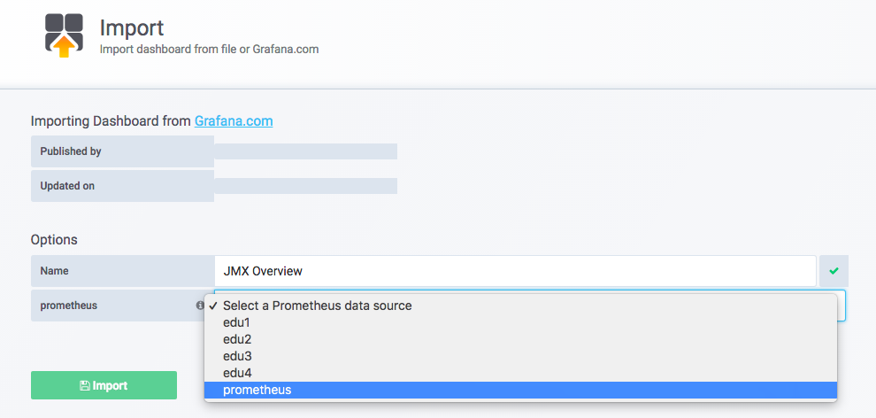
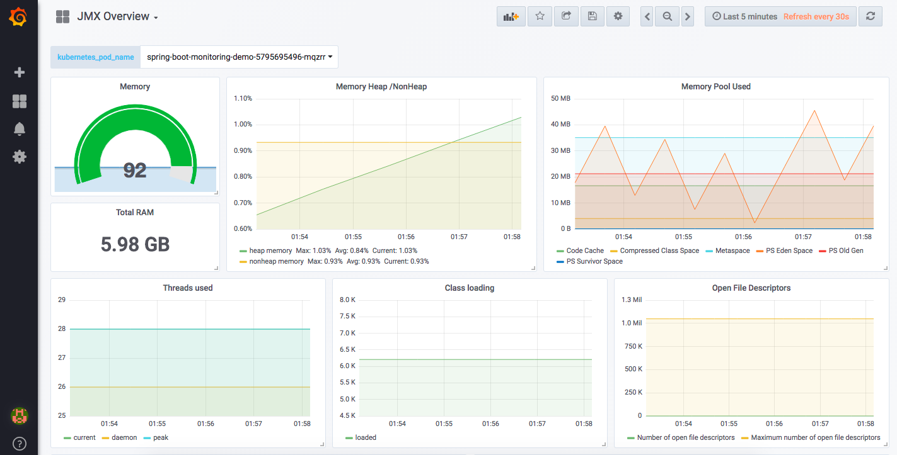
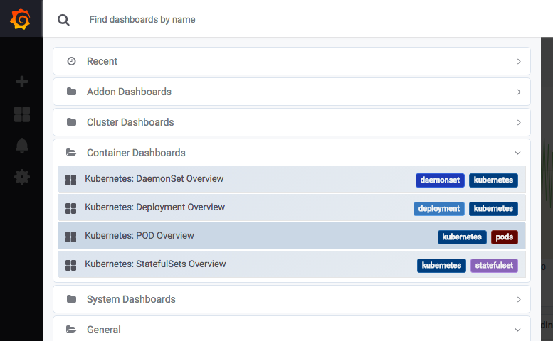

# Container Monitoring


일반적으로 호스트에서 실행 중인 모든 컨테이너의 상태 정보를 확인하는 경우가 많다. 

```bash
$ docker stats <container-name> 
```

docker  ps –q는 실행 중인 모든 컨테이너의 ID를 반환하여, docker inspect –f {{.Name}} 의 입력값으로 사용한다. docker inspect 명령은 ID를 이름으로 바꾸어서 docker stats명령으로 전달한다. 


```bash
$docker stats \
$(docker inspect -f {{.Name}} $(docker ps -q))
```

## cAdvisor

추가 필요 


## k8s Application Monitoring with Prometheus

```bash
$ git clone https://github.com/YunSangJun/monitoring-demo.git
$ cd monitoring-demo
```
#### Maven build

```bash
$ mvn clean package
```
Dockerfile 편집
```
$ vi Dockerfile
FROM openjdk:8-jdk-alpine

ADD target/spring-boot-monitoring-demo-0.0.1-SNAPSHOT.jar app.jar
ADD jmx-exporter/jmx_prometheus_javaagent-0.3.1.jar jmx_prometheus_javaagent-0.3.1.jar
ADD jmx-exporter/tomcat.yaml tomcat.yaml

ENTRYPOINT ["java","-Djava.security.egd=file:/dev/./urandom","-javaagent:/jmx_prometheus_javaagent-0.3.1.jar=8090:/tomcat.yaml","-jar","/app.jar"]
```

 - ADD target/spring-boot-monitoring-demo-0.0.1-SNAPSHOT.jar app.jar
 
 Demo application을 Docker container에 추가

 - jmx-exporter/jmx_prometheus_javaagent-0.3.1.jar

Prometheus JMX exporter agent를 Docker container에 추가

- jmx-exporter/tomcat.yaml tomcat.yaml

JMX exporter Tomcat configuration file을 Docker container에 추가

- ENTRYPOINT ...

Demo App 및 JMX exporter agent 실행

#### Docker build

```
$ docker build -t spring-boot-monitoring-demo .

$ docker images
REPOSITORY                        TAG                 IMAGE ID          CREATED            SIZE
spring-boot-monitoring-demo       latest              1444f50dcadc      9 seconds ago      117M
```

#### Application 실행
```
$ docker run -p 8080:8080 -p 8090:8090 spring-boot-monitoring-demo
```
 - Web browser에서 localhost:8080에 접속

Hello World! 메세지가 출력됨

 - Web browser에서 localhost:8090에 접속

아래와 같이 JVM metrics 출력됨

```
# HELP jvm_gc_collection_seconds Time spent in a given JVM garbage collector in seconds.
# TYPE jvm_gc_collection_seconds summary
jvm_gc_collection_seconds_count{gc="PS Scavenge",} 15.0
jvm_gc_collection_seconds_sum{gc="PS Scavenge",} 0.18
jvm_gc_collection_seconds_count{gc="PS MarkSweep",} 2.0
jvm_gc_collection_seconds_sum{gc="PS MarkSweep",} 0.262
...
```

 - Docker image를 Docker registry에 push
```
$ docker tag spring-boot-monitoring-demo:[VERSION] [REPOSITORY_ADDRESS]/spring-boot-monitoring-demo:[VERSION]

$ docker push [REPOSITORY_ADDRESS]/spring-boot-monitoring-demo:[VERSION]
```


### Demo Application 배포
 - Demo Application Deployment yaml에 discovery, docker image 정보 수정(default 그대로 사용해도 무관)

```yaml
$ vi kubernetes/deployment.yaml
...
spec:
  ...
  template:
    metadata:
      ...
      annotations:
        prometheus.io/scrape: "true"
        prometheus.io/port: "8090"
        prometheus.io/path: /metrics
    spec:
      containers:
      - name: spring-boot-monitoring-demo
        image: dtlabs/spring-boot-monitoring-demo:latest
```

 - spec.template.metadata.annotations.prometheus.io/scrape

  Discorvery 대상 여부

 - spec.template.metadata.annotations.prometheus.io/port

Discovery target port

 - spec.template.metadata.annotations.prometheus.io/path

Discovery target path

 - spec.template.spec.containers.image

Docker image path

### Demo Application 배포

```bash
$ kubectl apply -f kubernetes/deployment.yaml

$ kubectl get po
NAME                                              READY     STATUS    RESTARTS   AGE
spring-boot-monitoring-demo-5795695496-ljfkw      1/1       Running   0          1m
spring-boot-monitoring-demo-5795695496-mqzrr      1/1       Running   0          1m
```

 - Demo Application에 8080 Port Forwarding 설정

Web browser에서 localhost:8080으로 접속.

Hello World! 메세지가 출력됨.

``` bash
$ kubectl port-forward spring-boot-monitoring-demo-5795695496-ljfkw 8080:8080
Forwarding from 127.0.0.1:8080 -> 8080
```

 - Demo Application에 8090 Port Forwarding 설정

Web browser에서 localhost:8090으로 접속.

아래와 같이 JMX metrics가 출력됨.

```bash
# HELP jvm_gc_collection_seconds Time spent in a given JVM garbage collector in seconds.
# TYPE jvm_gc_collection_seconds summary
jvm_gc_collection_seconds_count{gc="PS Scavenge",} 15.0
jvm_gc_collection_seconds_sum{gc="PS Scavenge",} 0.18
jvm_gc_collection_seconds_count{gc="PS MarkSweep",} 2.0
jvm_gc_collection_seconds_sum{gc="PS MarkSweep",} 0.262
...
```

### Monitoring Dashboard 구성 및 활용
#### JMX Dashboard 구성
 - Grafana Dashboard 접속 > Left 메뉴 > + 버튼 선택 > Import 메뉴 선택


 - Upload .json File 버튼 선택

다운로드 받은 spring-boot-monitoring-demo 프로젝트 > jmx-exporter > jmx-exporter-tomcat-grafana-dashboard.json 파일 import


- Options > prometheus combo box > 원하는 data source 선택 > Import 버튼 선택



참고 : data source 설정은 prometheus로 부터 data를 검색하기 위한 용도
Heap Memory, Threads, Class Loading, Open File, GC 등에 대한 metrics을 그래프 형태로 조회



### Pod(Application) Dashboard 활용
Kubernets cluster 용도로 Prometheus 구성 시 동적으로 생성되는 Pod를 discovery 해서 자동으로 metric을 수집합니다. 이 문서에서는 Kubernetes cluster를 위한 Prometheus와 Grafana가 설치되어 있다는 전제하에 작성했습니다. Prometheus와 Grafana 설치에 대한 가이드는 추후 작성 예정입니다.

 - Dashboard List > Container Dashboards > Kubernetes: POD Overview 선택




 - Pod(Application)의 cpu, memory, network metrics을 그래프 형태로 조회


### Reference
 - https://yunsangjun.github.io/blog/kubernetes/2018/07/20/kubernetes-monitoring.html


